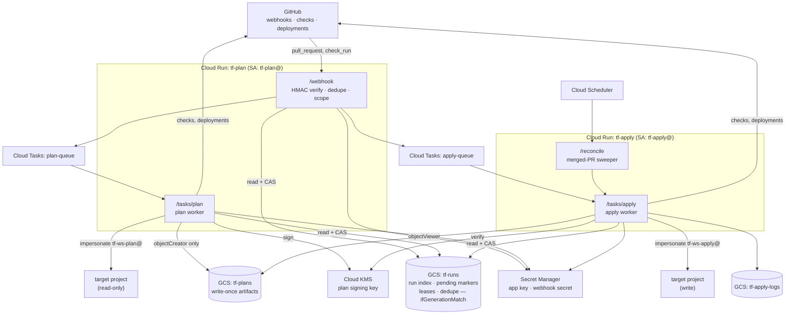

# terraform-on-github — Design

**Status:** sketch / RFC
**Date:** 2026-08-19 · revised 2026-08-21

A GitHub App that runs Terraform plans on pull requests and applies the *reviewed*
plan on merge. Two Cloud Run services with disjoint IAM: one that can only read
infrastructure, one that can only write it.

---

## 1. Goals & non-goals

### Goals

1. A repo declares a mapping of **base branch → (directory, workspace, backend, target project)**.
2. On PR open / push, plan every workspace the PR could affect. One GitHub check run per workspace.
3. Persist the plan artifact keyed by `(base SHA, head SHA)` so the reviewed plan is the applied plan.
4. On merge, apply that exact saved plan — or refuse, loudly, if it is no longer valid.
5. The service that plans **cannot** mutate infrastructure. The service that applies **cannot** be
   triggered by anything except a verified, merged PR with a signed plan.
6. A compromised plan service leaks read access to one workspace at a time, and nothing else.
7. **Detect drift.** On a schedule, plan every configured workspace against its base branch
   with no PR in flight. A non-empty plan means reality has diverged from the committed
   state; report it as an issue. Reuses the plan worker and the read-only tier — drift
   detection never gains the ability to correct what it finds.
8. **GitHub is the entire interface.** Checks, PR comments and Deployments carry every
   result, approval and audit trail the system produces. No web UI — no second place to
   look, no separate session to authenticate, no state that outlives the pull request.

### Non-goals (v1)

- Automatic drift *remediation*. Drift is reported, never silently applied; closing it goes
  through a PR like any other change.
- Policy-as-code enforcement. `plan.json` is the natural input to conftest/OPA — see §12.
- Non-GCP providers. v1 uses GCP service-account impersonation for target credentials.
  AWS/Azure would arrive via Workload Identity Federation, same shape.
- State migration, import flows, `terraform destroy`.

---

## 2. Component overview



The webhook receiver lives inside the **plan** service — it is the lower-privilege of the
two, and folding it in keeps the deploy at the two services asked for. See §7.4 for the
consequence (plan service can *enqueue* applies) and why that is safe.

---

## 3. Configuration: branch → folder → workspace

`.terraform-on-github.yaml`, at the repo root. Full schema in [CONFIG.md](./CONFIG.md).

```yaml
version: 1

defaults:
  terraform_version: "1.9.8"
  plan_timeout: 20m
  summary_detail: addresses      # addresses | full

workspaces:
  - name: prod-networking
    branch: main                 # base branch this workspace is bound to
    dir: envs/prod/networking
    watch:                       # extra paths that invalidate this workspace
      - modules/vpc/**
    backend:
      bucket: acme-tfstate-prod
      prefix: prod/networking
    impersonate:
      plan:  tf-prod-networking-plan@acme-tf.iam.gserviceaccount.com
      apply: tf-prod-networking-apply@acme-tf.iam.gserviceaccount.com
    apply:
      environment: prod-networking   # GitHub Environment → approval gate
      on_stale: replan_if_equivalent # fail | replan_if_equivalent
```

### 3.1 The config is read from one trusted ref, not from the PR's base

**This is the single most important rule in the system.** The config is fetched at
`config_ref` — a single ref declared *outside* the repository, in this app's own Terraform —
never from the PR head, and **never from the PR's base branch**.

The reason the head is wrong is obvious: a PR could rewrite `impersonate.apply` to point at a
privileged service account, or repoint `dir` at a production workspace, and the app would hand
it credentials.

The reason the *base* is wrong took a second look, and it is the more interesting failure.

#### 3.1.1 Why "base branch" is not the same as "reviewed"

An earlier draft of this document read the config from the PR's base branch and justified it as
"the mapping has already been through review and branch protection". That justification silently
assumes every base branch is protected. In a promotion flow it is not:

```
feature ──▶ integration ──▶ prod
            (open to devs)   (protected)
```

`integration` exists precisely so developers can merge into it freely. So:

1. Open `feature → integration`. Merge it. It adds a workspace entry — `branch: integration`,
   `dir: envs/prod/networking`, `impersonate.apply: tf-prod-networking-apply@`.
   No production review was needed, because the PR targeted `integration`.
2. `integration`'s tip now carries a hostile mapping.
3. Open `feature2 → integration`. The app reads config from the base branch — `integration` —
   and finds the hostile mapping sitting there looking reviewed.
4. That PR plans, and on merge to `integration`, **applies to production with the production
   apply identity.**

The `tokenCreator` bindings in §7 do not save this. They are granted from `tf-apply@` to each
per-workspace SA globally, not per repo and not per branch, so a config that merely *names*
`tf-prod-networking-apply@` can use it. IAM conditions cannot help either — there is no
attribute for "the git ref this request is about".

The property the design actually needs is not "the config came from a base branch". It is:

> **the ref that declares authorization must be one the requester cannot write to.**

For a single-branch repo those coincide, which is why the bug was invisible. For any promotion
flow they come apart.

#### 3.1.2 The fix: one trusted ref, declared outside the repo

All config — every field, for every workspace, whatever branch a PR targets — is read from one
ref per repository, declared in `deploy/` alongside the service accounts:

```hcl
repos = {
  "acme/infra" = { config_ref = "refs/heads/main" }
}
```

**The trust anchor cannot be named by the thing it anchors.** If `.terraform-on-github.yaml`
declared its own trusted ref, a hostile edit would declare its own branch. So `config_ref` lives
app-side, next to the IAM that grants the identities it references — the same review surface, the
same change-control.

Under this model the attack above dies at step 3: config comes from `main`, which the developer
cannot write to, and `main`'s config has no entry authorizing a production identity for
`branch: integration`.

Defaulting `config_ref` to the repository's default branch is reasonable and usually right.
Pinning it explicitly is stronger, because a repo admin can change the default branch.

#### 3.1.3 Multi-stage flows are then just two entries

```yaml
# read from refs/heads/main — the only ref that can change any of this
workspaces:
  - name: integration-networking
    branch: integration            # devs may merge here freely
    dir: envs/integration/networking
    impersonate:
      apply: tf-integration-networking-apply@…   # integration blast radius only
  - name: prod-networking
    branch: main                   # protected; requires review
    dir: envs/prod/networking
    impersonate:
      apply: tf-prod-networking-apply@…
```

A developer with merge rights to `integration` can reach exactly the integration identity. The
promotion flow works normally; what does *not* work is escalating through it.

#### 3.1.4 What this costs

- **Layout changes to a non-terminal branch need a PR to the trusted ref.** Adding a directory
  for `integration` means a PR to `main`. Slightly inverted, and correct: it is a privileged
  change. It is also already true — the workspace's service accounts have to be added in
  `deploy/` regardless (§7).
- **Config and code can drift between branches.** The config on `main` may name a `dir` that
  does not exist yet on `integration`. Treat a missing `dir` in the planned tree as a `skipped`
  check, not a failure, or every integration PR goes red during a migration.
- **One fewer thing to reason about**, in exchange: there is no longer a per-branch question of
  "was this config trustworthy?"

Corollary, unchanged in spirit: **a PR that changes `.terraform-on-github.yaml` takes effect only
after it merges to the trusted ref.** Such a PR gets a check run explaining that, with the config
diff rendered for the reviewer.

#### 3.1.5 Hardening: move authorization out of the repo entirely

The fix above makes one ref authoritative. It does not change the fact that *whoever can merge to
that ref controls every identity the app can assume*. Usually fine — they control the Terraform
being applied too. Where it is not fine, take the next step and split the file by trust:

| Declares | Owner | Fields |
|---|---|---|
| **Authorization** | `deploy/`, keyed `(repo, branch, workspace)` | which plan/apply SA, whether apply is enabled |
| **Layout** | repo, at `config_ref` | `dir`, `watch`, `backend`, `var_files`, timeouts |

The repo then names a workspace; the app decides whether that `(repo, branch, workspace)` triple
is authorized and which identity it gets. A hostile entry naming `prod-networking` on
`branch: integration` finds no matching triple, so there is no identity and nothing runs.

Note that layout tampering alone is contained: repointing a workspace's `dir` at production
Terraform still executes under that workspace's identity, which has no permission on the
production project. **The identity is the boundary** — which is exactly why the app should own
the identity mapping and why this is the direction to grow in.

For the same reason, security-relevant knobs should be **app-owned, repo-narrowing-only**: the
effective `module_sources` allowlist is the intersection of the app's and the repo's, and a repo
may tighten `summary_detail` but never widen it to `full`. Otherwise a merge to the trusted ref
can widen the plan-time code allowlist (§8) or dump state secrets into a check (§8.1), and those
are exactly the knobs you least want delegated.

#### 3.1.6 Optional check: verify the premise instead of assuming it

The app can verify that a workspace's `branch` is actually protected —
`GET /repos/{o}/{r}/branches/{branch}/protection` — and refuse to apply if it has no required
reviews. That turns "this branch is reviewed" from an assumption into an assertion, and it would
have caught the original bug at runtime.

It costs the App the `administration: read` permission, which is a real widening of §7.3's
minimum set. Worth it for prod-tier workspaces; make it a per-workspace
`require_protected_base` rather than a global default.

### 3.2 Scoping a PR to workspaces

```
base_ref   = pr.base.ref
base_sha   = tip of base_ref, resolved NOW  (not pr.base.sha — that is the SHA at PR
                                             creation time and goes stale immediately)
cfg        = config read at config_ref      (NOT at base_sha — see §3.1)
changed    = GET /repos/:o/:r/compare/:base_sha...:head_sha   (paginated)

candidates = { w ∈ cfg.workspaces : w.branch matches base_ref }
in_scope   = { w ∈ candidates : any(changed) under w.dir or matching w.watch }
```

Note what each input is trusted for. `cfg` comes from a ref the PR author cannot write to and
decides *which identity* may be assumed. `base_ref` and `changed` come from the PR and decide
only *which of the authorized workspaces is relevant*. Confusing those two roles is what §3.1
is about.

If `in_scope` is empty, post one `skipped` check and stop. If `.terraform-on-github.yaml`
itself changed, add the advisory check from §3.1.

`watch` is explicit rather than derived from the module graph. Deriving it properly means
running `terraform init` before you know whether you should — which is exactly the code
execution we are trying to gate. Explicit globs on the trusted ref are the trustworthy version.

---

## 4. Plan flow

```mermaid
sequenceDiagram
  autonumber
  participant GH as GitHub
  participant RX as plan-svc /webhook
  participant Q as Cloud Tasks
  participant PW as plan-svc worker
  participant TF as Terraform (impersonated, read-only)
  participant CO as GCS tf-runs
  participant PB as GCS tf-plans

  GH->>RX: pull_request.synchronize
  RX->>RX: verify HMAC-SHA256, dedupe on X-GitHub-Delivery
  RX->>GH: read .terraform-on-github.yaml @ base_sha
  RX->>GH: compare base_sha...head_sha
  RX->>GH: create check run per workspace (queued)
  RX->>Q: enqueue plan task per workspace
  RX-->>GH: 202 (well under the 10s webhook budget)

  Q->>PW: POST /tasks/plan (OIDC)
  PW->>CO: create run object, ifGenerationMatch=0 (claim)
  PW->>PW: 412? already planned → reuse artifact, refresh check
  PW->>GH: check run → in_progress
  PW->>PW: fetch refs/pull/N/merge; assert parents == (base_sha, head_sha)
  PW->>TF: init -lock=false; plan -lock=false -out=tfplan -detailed-exitcode
  PW->>PW: show -json → plan.json; show → plan.txt
  PW->>PB: put tfplan, plan.json, plan.txt, meta.json (write-once)
  PW->>GH: check run → success/failure + redacted summary
```

### 4.1 Require the branch to be up to date, then plan the head

A plan of the PR head is only meaningful if the head already contains everything on the base
branch. So rather than planning a synthetic merge, **require that and refuse otherwise**:

```
cmp = GET /repos/:o/:r/compare/:base_sha...:head_sha
cmp.status ∈ {ahead, identical}  → base is an ancestor of head; plan the head
cmp.status ∈ {behind, diverged}  → failure check: "update your branch", no plan
```

When base is an ancestor of head, the merge is content-trivial: squash, rebase and merge-commit
all produce a commit whose **tree is identical to the head's tree**. So the head *is* the merge
result, and `planned_tree_sha = head_sha^{tree}`.

An earlier draft planned GitHub's test-merge commit (`refs/pull/N/merge`, with an assertion on
its parents) to get this property without asking developers to rebase. Requiring
up-to-dateness is the better trade for this domain, for four reasons:

1. **The plan becomes unambiguously about the developer's change.** A test-merge plan can show
   resource changes that came from somebody else's commit on base. The author sees them in
   *their* check and has to work out which lines are not theirs — which is precisely the moment
   you least want ambiguity.
2. **A whole retry state machine disappears.** `refs/pull/N/merge` is a mutable ref GitHub
   recomputes asynchronously, so it needed a parent assertion, an `ErrMergeNotReady` retryable
   error, and backoff. The compare call is synchronous and answers directly.
3. **Merge conflicts surface as themselves.** `diverged` plus a real conflict is one message —
   "update your branch" — instead of inferring intent from a missing ref.
4. **It nearly eliminates the stale-plan path** (§6.3). If up-to-dateness is enforced at merge
   time too, the second of two concurrent PRs is forced to update and re-plan rather than
   arriving at merge with a plan built against a state that has moved.

The cost is real and worth naming: **it serializes merges to a branch**, and every merge puts
every other open PR one update behind. For a general-purpose repo that is a rebase treadmill.
For a Terraform repo it is mostly a feature — you generally do not want two infrastructure
changes landing concurrently, and merge volume is low. Where it does hurt, GitHub's **merge
queue** is the escape hatch: it maintains up-to-dateness itself, so this check simply passes.

Turn on branch protection's `Require branches to be up to date before merging` as well. The app
implements its own check regardless — it works whatever the protection settings are, gives a
better message, and needs no `administration: read` — but having GitHub enforce the same rule
means the merge button and the check agree.

§6.2 explains why `planned_tree_sha` is still what makes merge-time verification robust; the
check is now simply *tree of the head* rather than tree of a synthetic commit.

### 4.2 Plan runs read-only, including against state

`terraform plan -lock=false`. The GCS backend implements locking by writing a `.tflock`
object into the state bucket, so a locking plan would need write access to state — which
would break the whole premise. With `-lock=false` the plan SA needs only
`storage.objectViewer` on the state prefix.

The race this admits (an apply lands mid-plan) is *already* handled: Terraform refuses to
apply a saved plan whose state lineage/serial has moved. The lock buys nothing here that
the plan-file staleness check does not already provide, and it costs the read-only
property. Drop it.

### 4.3 Exit codes

`-detailed-exitcode` gives `0` = no changes, `2` = changes present, `1` = error. Both 0 and
2 are `success` conclusions on the check — the summary carries the difference. Making
"has changes" a failing check trains people to ignore red.

---

## 5. Plan storage & keying

```
gs://acme-tf-plans/
  pr/<owner>/<repo>/<workspace>/<base_sha>/<head_sha>/
      tfplan          # opaque binary — the thing that gets applied
      plan.json       # terraform show -json  (summary, equivalence, future policy checks)
      plan.txt        # terraform show        (human diff, behind a signed URL)
      meta.json       # provenance, signed

  drift/<owner>/<repo>/<workspace>/<base_sha>/<scan_id>/
      plan.json       # what diverged
      plan.txt        # the body of the issue
      meta.json       # provenance, signed — kind: "drift"
```

Two key shapes, two top-level prefixes, and **no key is ever reachable under both** — see
§5.6. A drift run writes no `tfplan`: nothing will apply it, and the file that would be
applied is the one worth not having (§6.6).

`meta.json`:

```json
{
  "schema": 1,
  "kind": "pr",                    // "pr" | "drift" — inside the signature
  "repo": "acme/infra",
  "pr": 412,
  "workspace": "prod-networking",
  "base_sha": "a1b2...", "head_sha": "c3d4...",
  "merge_commit_sha": "e5f6...",
  "planned_tree_sha": "9876...",
  "terraform_version": "1.9.8",
  "provider_lock_sha256": "...",
  "plan_sha256": "...",
  "has_changes": true,
  "resource_change_counts": { "create": 3, "update": 1, "delete": 0, "replace": 0 },
  "planned_at": "2026-08-19T14:02:11Z",
  "signature": "<Cloud KMS asymmetric signature over the canonical digest>"
}
```

### 5.1 The plan bucket is as sensitive as the state bucket

A Terraform plan file **embeds a snapshot of prior state**. Every secret in state is in the
plan. Treat the plan bucket exactly like the state bucket: CMEK, uniform bucket-level
access, public access prevention, object versioning, 90-day lifecycle delete, and audit
logging on data reads.

### 5.2 Write-once, no read-back

The plan service holds `roles/storage.objectCreator` on the plan bucket and *nothing else*.
That role can create an object but cannot read one and cannot overwrite an existing name,
which buys write-once semantics for free: the plan service cannot swap a plan after the
check has been published, and cannot read plans belonging to other workspaces or repos.

Cache-hit detection therefore cannot be an existence check against *this* bucket — the plan
service is not permitted to look. The **coordination bucket** (§5.4) is the authority on "have we
already planned this pair"; this one is append-only cold storage.

### 5.3 Signing

The plan service signs `SHA256(canonical(meta) ‖ plan_sha256)` with a Cloud KMS asymmetric
key (`roles/cloudkms.signerVerifier` → *signer only*). The apply service holds only
`cloudkms.publicKeyViewer` and verifies. Bucket IAM already separates the two; the
signature is the layer that survives an IAM misconfiguration.

### 5.4 Coordination: a second bucket, not a database

There is no Firestore, no Datastore, no Postgres. Run state, the claim, the apply lease and
the webhook dedupe set all live in a second GCS bucket, coordinated by two preconditions:

| Precondition | Semantics | Used for |
|---|---|---|
| `ifGenerationMatch=0` | atomic create-if-absent | claim a run, record a delivery id, take a free lease |
| `ifGenerationMatch=<gen>` | atomic compare-and-set | transition a run, steal an expired lease |

This is the same primitive **Terraform's own GCS backend** uses to lock state — it writes
`<prefix>/default.tflock` with `ifGenerationMatch=0` — so the app coordinates itself the way
the tool it wraps already does. GCS also gives strongly consistent reads *and* strongly
consistent list, which is what makes §5.5 work.

```
gs://acme-tf-runs/
  runs/pr/<owner>/<repo>/<workspace>/<base_sha>/<head_sha>.json
  runs/drift/<owner>/<repo>/<workspace>/<scan_id>.json
  pending-apply/<owner>/<repo>/<pr>/<workspace>/<base_sha>__<head_sha>
  drift-open/<owner>/<repo>/<workspace>.json     # open issue number, first seen
  leases/<owner>_<repo>_<workspace>
  deliveries/<delivery-id>
```

`pending-apply/` has no drift shape and never will — that absence is half of §6.6.

**Why a second bucket rather than the plan bucket.** The plan service holds
`objectCreator`-only on artifacts — no read, no overwrite, which is the whole of §5.2 — and
coordination needs read plus overwrite, because that is what compare-and-set is. One bucket
cannot be both. Splitting them keeps each property intact, and the wider grant is affordable
precisely because this bucket holds SHAs, states and timestamps: no plan output, so no state
snapshot and no secret. Putting an artifact in here would quietly undo §5.2.

**What we give up.** Object names become schema. There are no queries, only prefix listings, so
every question the app asks has to be answerable from a key — which is why §5.5 exists, and why
renaming a workspace is a migration. If v2 grows a dashboard wanting "every run for this repo
last week", that is the point to add a real database; nothing in v1 needs one.

Also: expiry is a bucket lifecycle rule rather than a per-key TTL. Lifecycle is day-granular and
asynchronous, so delivery ids survive one to two days instead of exactly 24h. Fine — the window
only has to outlive GitHub's retry schedule, and over-retention costs kilobytes.

**AWS note.** S3 gained conditional writes (`If-None-Match`) in 2024, and Terraform's own S3
backend now locks with `use_lockfile` instead of requiring a DynamoDB table. The whole scheme
ports; the historical need for a database alongside object storage has gone away.

### 5.5 The one question that is not a single-key lookup

`/reconcile` needs "which runs are waiting to apply", and object storage cannot answer it. So
searchable state is encoded in a **key** rather than a field: one marker object per outstanding
apply, under `pending-apply/`. The set of objects under that prefix *is* the work queue.

Field order runs widest-to-narrowest so both queries are single prefix scans:

```
/reconcile   lists  pending-apply/                       → every outstanding apply
supersede    lists  pending-apply/<owner>/<repo>/<pr>/    → this PR's, to drop stale heads
```

Listing costs O(outstanding) rather than O(every run ever) — and a listing that keeps growing is
itself the alert, which is the right behaviour for a backstop.

**Ordering matters, because there is no transaction across two objects.** Write the marker
immediately after `meta.json` (the artifact's completion marker) and *before* flipping the run
object to `planned`. A crash between the two then fails toward "a marker exists for a complete
plan", which `/reconcile` picks up and re-verifies — never toward "a complete plan nobody will
ever apply", which is the failure nothing turns red for.

Worth being honest that this window is not a GCS limitation: the artifact upload and any index
write are in different systems whichever index you pick, so a database would not have closed it
either.

Supersede is multi-object and therefore not atomic, and does not need to be. It is idempotent
cleanup: a partial pass leaves a stale marker, `/reconcile` hands it to `apply.Verify`, and
verification rejects it. **The marker set is an optimization over re-verification, never a
substitute for it** — which is the same principle as §6.1.

### 5.6 Drift runs: keying without a head

A scheduled scan (goal 7) has a base but no head: there is no PR, no proposed commit, no
`head_sha` to key on. Three properties have to survive that.

**A drift key cannot borrow the head slot.** The obvious encoding — a synthetic
`(base_sha, base_sha)` pair — breaks on §5.2. Write-once means a name can be created exactly
once, and `main` sits at one `base_sha` for as long as nobody merges: the 03:00 scan takes the
key, and every scan after it until the next merge fails to upload. A scheme where the *second*
run of a recurring job cannot store its output is not a keying scheme. The scan needs its own
coordinate.

**That coordinate is the scheduled time, not the wall clock.**

```
drift/<owner>/<repo>/<workspace>/<base_sha>/<scan_id>/
scan_id = 20260828T030000Z        # the scheduled tick, from the Cloud Scheduler job
```

Taken from the tick rather than from `time.Now()`, `scan_id` makes a retried or double-fired
delivery land on the key it already wrote — write-once turns a duplicate scan into a `412`
instead of a second issue, the same way `deliveries/` dedupes webhooks. It also sorts
lexicographically, so "the last five scans of this workspace" is a prefix listing bounded by
`base_sha`, and per-`base_sha` grouping means a merge naturally starts a fresh series.

**And drift lives under its own top-level prefix**, so `pr/…` and `drift/…` are disjoint
namespaces rather than two readings of one path. The apply worker composes plan keys from
`(repo, workspace, base_sha, head_sha)` and prefixes them `pr/`; there is no value of
`head_sha` that reaches a drift object. §6.6 is what holds if that argument is ever wrong.

**What drift does not write.** No `tfplan`, and no `pending-apply/` marker. The first means
the artifact an apply consumes does not exist; the second means `/reconcile` — which
enumerates work by listing that prefix (§5.5) — cannot see drift runs at all. Both are
absences rather than checks, which is the point: there is no code path to get wrong.

Everything else is unchanged. `plan.json` still embeds a state snapshot, so drift artifacts
are as sensitive as any other (§5.1) and get the same bucket, CMEK and lifecycle. `meta.json`
is signed by the same key over the same digest, now covering `kind` (§5.3). And the plan
worker still never reads back what it wrote: it holds `plan.json` in memory, so the issue
body is composed before upload, not fetched after it (§5.2).

**Reporting is a single-key lookup.** `drift-open/<owner>/<repo>/<workspace>.json` records the
issue number and when drift was first seen. A scan that finds changes either opens an issue and
creates that object with `ifGenerationMatch=0`, or finds it already there and comments on the
existing issue; a scan that comes back clean closes the issue and deletes the object. One open
issue per drifted workspace, however many scans run — the alternative, a new issue every tick,
is how a drift detector gets muted.

---

## 6. Apply flow

```mermaid
sequenceDiagram
  autonumber
  participant GH as GitHub
  participant AW as apply-svc worker
  participant PB as GCS tf-plans
  participant TF as Terraform (impersonated, write)

  Note over AW: trigger is a *hint*; authorization is re-derived
  AW->>GH: GET /pulls/:n — merged? merge_commit_sha? head.sha?
  AW->>GH: assert merge_commit_sha^1 == base_sha  (base did not move)
  AW->>PB: fetch tfplan + meta.json
  AW->>AW: KMS verify; assert meta binds (repo, ws, base, head)
  AW->>GH: assert merge_commit^{tree} == meta.planned_tree_sha
  AW->>GH: create Deployment → environment gate (required reviewers)
  GH-->>AW: approved
  AW->>AW: acquire advisory lease, ifGenerationMatch=0 (after approval, never before)
  AW->>TF: init; apply tfplan
  alt saved plan is stale (state moved)
    AW->>AW: §6.3 equivalence path
  end
  AW->>GH: check run + deployment status + apply log
```

### 6.1 Nothing in the trigger is trusted

The apply worker treats its task payload as a pointer, not a permission. Every field is
re-derived from GitHub and from the signed plan metadata before a single Terraform command
runs. This is what makes it acceptable for the plan service to hold enqueue rights on the
apply queue (§7.4): the worst a compromised plan service can do is ask the apply service
to re-verify something that will not verify.

### 6.2 Tree-SHA equality survives squash merges

The obvious check — "does the merge commit equal the commit we planned?" — fails the moment the
repo uses squash or rebase merges, because those produce a commit that has never existed before.

Content, however, is preserved. Because §4.1 guarantees the head already contains all of base,
every merge strategy produces a commit whose **tree** is byte-identical to the head's tree:

| Strategy | Merge commit SHA | Merge commit tree |
|---|---|---|
| merge commit | new | `= head^{tree}` |
| squash | new | `= head^{tree}` |
| rebase | rewritten | `= head^{tree}` |

So compare `merge_commit_sha^{tree}` against `meta.planned_tree_sha`. That single comparison
proves the applied working tree is exactly the reviewed working tree, independent of merge
strategy, commit metadata, author, or message.

If base moved between plan and merge, the merged tree picks up those commits, the trees differ,
and the check fails — correctly, and without needing a separate git-ancestry argument. This is
the backstop behind §4.1's up-to-date check: the check is the friendly early error, the tree
comparison is what actually holds the guarantee.

`Require branches to be up to date before merging` (branch protection) or GitHub's merge
queue makes this failure rare. On a busy repo, use the merge queue: it plans against the
speculative merge SHA, which is what you actually want.

### 6.3 When the plan is stale

Terraform refuses a saved plan whose state lineage or serial has moved. `on_stale: fail` is the
only v1 behaviour: post a failing check, set the deployment to failure, require a human to
re-request.

**§4.1 removed most of the reason this section existed.** The motivating case was two PRs merging
back-to-back into one workspace: the first apply bumps the serial, the second arrives with a plan
built against the old one. With up-to-dateness enforced at merge time, the second PR cannot merge
until it has been updated and re-planned, so it never reaches apply with a stale plan. What
remains is genuinely exceptional — an out-of-band `terraform apply` from a laptop, a state
restore, another system writing the same state — and every one of those is something a human
should look at rather than something to auto-recover from.

An earlier draft specified `replan_if_equivalent`: re-plan at the merge commit and apply the new
plan if a normalized projection of `plan.json` matched the reviewed one. It is **cut**, not
deferred. It carried the hardest correctness problem in the design — set-versus-list comparison
needs the provider schema, and a false positive applies an unreviewed change to production — in
exchange for automating a case that should now barely occur. The sketch keeps
`internal/plan/equivalence.go` as a documented dead end so the reasoning is not relitigated.

If a repo genuinely cannot enforce up-to-dateness, the answer is GitHub's **merge queue**, which
plans against the speculative merge SHA and keeps the property without a rebase treadmill —
not a semantic plan-differ.

### 6.4 Approval gating via GitHub Environments

Each workspace names a GitHub Environment. The apply worker creates a Deployment to it;
GitHub's native environment protection rules (required reviewers, wait timer, branch
restrictions) hold it in `queued`. Approvers use a UI they already know, and the audit trail
lives with the repo rather than in this app's database.

The worker cannot block for hours on one request, so it polls: not-yet-approved returns a
retryable status and Cloud Tasks backs off, up to `apply.approval_timeout` (default 24h).
Cheap, no extra state machine.

### 6.5 Serialization

One apply per workspace at a time, via an advisory lease object (§5.4). Terraform's own
`.tflock` is the correctness lock, and a saved plan additionally carries the state lineage and
serial it was built against — two independent guarantees that two applies cannot both mutate one
state. The lease exists only so the loser finds out in milliseconds instead of after a checkout
and an `init`, and can say something coherent in its check.

Because it is advisory, it needs no fencing token: it is protecting an invariant Terraform already
protects. An earlier draft of this design carried one, which was complexity that read as rigour.

Acquire it **after** environment approval, never before. The approval wait is a retryable task
response, so the instance is gone between polls and cannot renew anything; a lease spanning the
wait would have to outlive `approval_timeout` — up to 24h — which is not a lease, it is an outage
waiting for a crashed worker. Two PRs approved at once simply race for the lease at that point,
which is what it is for.

### 6.6 A drift plan is never applicable

Drift plans and PR plans are produced by the same worker, signed with the same key, and stored
in the same bucket. The only thing standing between "we plan continuously" and "a scheduled job
can push to production" is that the apply path refuses drift — so it refuses it three times,
independently:

| Guard | Fails on | Survives |
|---|---|---|
| No `pending-apply/` marker written (§5.6) | `/reconcile` never enumerates the run | a bug in the apply worker |
| Key prefix is `drift/`, apply composes `pr/` | fetch 404s before verification | a forged task payload |
| `meta.kind != "pr"` → reject | signed field, checked after KMS verify | both of the above |

The third is the one that has to exist, and the reason is §6.2. A drift scan of `main` plans
the tree at `main`'s tip — so `meta.planned_tree_sha` is exactly the tree that a
fast-forwardable merge commit would produce. The tree-SHA comparison, which is the check that
proves "the applied working tree is the reviewed working tree", **passes** against a drift
plan. It was never asked to prove the plan came from a reviewed pull request; nothing in that
comparison distinguishes a plan a human approved from one a cron job produced at 03:00.

So `kind` is checked, it is inside the signature rather than in the object path, and the check
is a whitelist — `kind == "pr"`, not `kind != "drift"` — because the next artifact kind this
design grows (a policy dry-run, a cost estimate) should be inapplicable by default rather than
applicable until someone remembers to add it to a deny list.

The apply worker holds no scheduler trigger and no drift code. It is not that drift chose not
to apply; it is that the apply service cannot be reached from a clock.

---

## 7. The IAM boundary

The point of two services. Neither runtime service holds *any* permission on a target
project. They hold the right to impersonate, and the impersonation targets are what carry
infrastructure permissions.

```
tf-plan@  --tokenCreator-->  tf-<ws>-plan@   --viewer-->        target project
                                             --objectViewer-->  state bucket

tf-apply@ --tokenCreator-->  tf-<ws>-apply@  --curated write--> target project
                                             --objectAdmin-->   state bucket/prefix
```

`roles/iam.serviceAccountTokenCreator` is granted **on each individual target service
account**, never at project level. `tf-plan@` cannot mint an apply identity; `tf-apply@`
cannot mint a plan identity. Adding a workspace means adding two bindings, which is exactly
the review surface you want.

Terraform reaches the target via the provider's `impersonate_service_account`, so no key
material exists anywhere.

### 7.1 Plan service (`tf-plan@`)

| Role | Scope |
|---|---|
| `roles/storage.objectCreator` | plan bucket — **create only**: no read, no overwrite |
| `roles/iam.serviceAccountTokenCreator` | each `tf-<ws>-plan@`, individually |
| `roles/cloudtasks.enqueuer` | plan-queue, apply-queue |
| `roles/iam.serviceAccountUser` | `tf-plan-invoker@`, `tf-apply-invoker@` (to attach OIDC to tasks) |
| `roles/secretmanager.secretAccessor` | `github-app-key`, `github-webhook-secret` |
| `roles/cloudkms.signer` | plan-signing key |
| `roles/storage.objectAdmin` | coordination bucket — CAS needs read + overwrite |

Explicitly **not** granted: `run.invoker` on the apply service, any role on any target
project, any read on the plan bucket, any write to state buckets.

### 7.2 Apply service (`tf-apply@`)

| Role | Scope |
|---|---|
| `roles/storage.objectViewer` | plan bucket |
| `roles/storage.objectAdmin` | apply-log bucket |
| `roles/iam.serviceAccountTokenCreator` | each `tf-<ws>-apply@`, individually |
| `roles/cloudkms.publicKeyViewer` | plan-signing key (verify only) |
| `roles/secretmanager.secretAccessor` | `github-app-key` |
| `roles/storage.objectAdmin` | coordination bucket |

Explicitly **not** granted: the webhook secret, KMS sign, any write to the plan bucket, any
ability to enqueue onto its own queue.

### 7.3 GitHub App permissions

One App. Minimum install permissions:

| Permission | Level | Why |
|---|---|---|
| Metadata | read | mandatory |
| Contents | read | clone, read config, read trees |
| Pull requests | read | scope, merge state; `write` only if you want PR comments |
| Checks | write | the primary output surface |
| Deployments | write | approval gate + apply audit trail |

Each service **down-scopes its own installation token** at mint time —
`POST /app/installations/{id}/access_tokens` accepts `permissions` and `repositories`, so
the apply worker requests `{checks: write, deployments: write, contents: read,
pull_requests: read}` for one repo, TTL 1h.

Residual risk, stated plainly: both services can read the App private key, so both *could*
mint a full-permission token. Hard separation requires **two GitHub Apps** (`TF Plan`, `TF
Apply`) with separate keys — at the cost of two installations to manage and two check-run
authors in the UI. Recommendation: one App for v1, revisit if the plan service ever grows
code paths you would not review as carefully as the apply service.

### 7.4 The one edge that is not eliminated

Because the webhook receiver lives in the plan service, `tf-plan@` can enqueue apply tasks.
Two mitigations, and you should take both:

1. **§6.1** — the apply worker re-derives authorization from GitHub and the KMS signature.
   A forged task fails verification.
2. **`/reconcile`** — Cloud Scheduler hits the apply service every minute; it sweeps
   `pending-apply/` for markers whose PR is now merged, and enqueues them itself.
   Run it alongside the push path as a backstop for lost tasks. If you want the trigger edge
   gone entirely, drop `cloudtasks.enqueuer` on `apply-queue` from `tf-plan@` and let
   `/reconcile` be the only path — you trade ~30s of latency for one fewer capability.

### 7.5 Ingress

The plan service needs public ingress for GitHub webhooks, which means `/tasks/plan` is
publicly reachable too — Cloud Run has no per-path ingress. So the worker verifies the
Google-signed OIDC token in-process on every `/tasks/*` request (audience = service URL,
issuer = `accounts.google.com`, email = the expected invoker SA). The apply service takes
`ingress=internal` and an invoker allowlist of exactly `tf-apply-invoker@`.

---

## 8. Untrusted code is the real threat

`terraform plan` is not a read-only operation on the *repository*. Before Terraform reaches
the plan graph it has already run `init`, which fetches providers and modules from wherever
the config says. And at plan time `data "external"` executes a local program, while
`data "http"` makes arbitrary requests. A PR is a code-execution request.

Controls, in order of how much they actually buy:

1. **Egress allowlist.** Cloud Run with `vpc-egress=all-traffic` through a VPC whose only
   routes out are the provider mirror and the Google APIs the target needs. This is the
   control that survives creative attackers; the rest are defence in depth.
2. **Provider mirror only.** `TF_CLI_CONFIG_FILE` with a `provider_installation` block
   declaring a `network_mirror` and no `direct` block. Providers you have not mirrored — the
   `external` provider, for instance — simply cannot be installed.
3. **Module source allowlist.** Parse HCL `source` attributes and match against a
   base-branch-configured allowlist *before* running `init`. Terraform has no native
   equivalent.
4. **Fork and first-time-contributor gating.** No automatic plan for PRs from forks or from
   authors without write access. Post a `action_required` check; a maintainer applies the
   `tf:plan-approved` label or comments `/plan`. Read-only credentials still expose your
   entire infrastructure inventory.
5. **Containment.** Plan credentials are read-only, ~1h, and scoped to one workspace's
   target project. The blast radius of full compromise of a plan run is: read one
   environment.
6. **Ephemeral, non-root, read-only rootfs** except `/workspace` (tmpfs). One Cloud Run
   instance per plan; `max-instances` bounds spend.

Also: **redact the check summary.** `plan.json` marks sensitive values, but Terraform's
notion of sensitive is not yours — a secret pasted into a `user_data` script is not marked.
Default `summary_detail: addresses` renders address + action + counts only, with the full
diff behind a 15-minute signed URL. `full` is an opt-in per workspace.

---

## 9. Check run output

One check per workspace, named `terraform/plan (prod-networking)`. Summary:

```
prod-networking · envs/prod/networking · 3 to add, 1 to change, 0 to destroy

  + google_compute_subnetwork.app["c"]
  ~ google_compute_firewall.allow_health_checks
  + google_service_account.runner
  + google_project_iam_member.runner_logging

plan a1b2c3d…c3d4e5f · terraform 1.9.8 · 42s
[view full diff]  (signed link, expires in 15m)
```

Truncate at ~200 resource addresses; both `summary` and `text` cap at 65535 bytes and
GitHub silently rejects oversize payloads. On merge, the plan check is *updated* with the
apply outcome so the PR timeline reads as one story.

---

## 10. Failure modes

| Failure | Behaviour |
|---|---|
| Base branch moved after plan | Tree-SHA mismatch → `fail` or equivalence path (§6.3) |
| Concurrent apply moved state | Terraform refuses the saved plan → `fail` (§6.3). Now rare: §4.1 forces the second PR to update and re-plan |
| PR branch behind base | `failure` check — "update your branch". Not a retry (§4.1) |
| Merge conflict | Reported as part of the same `diverged` result — one message, not two |
| PR merged, plan never completed | `/reconcile` finds no pending marker → check + comment, no apply |
| Plan artifact missing or signature invalid | Hard fail, page. Never re-plan-and-apply silently |
| Config invalid on base branch | Single `failure` check on every PR against that branch |
| Apply partially applied then crashed | State reflects reality; next plan shows the remainder. Lease TTL expires; do **not** auto-retry — a human reads the apply log first |
| Duplicate webhook delivery | Create-if-absent under `deliveries/`; bucket lifecycle expiry |
| Plan exceeds Cloud Tasks 30m dispatch deadline | Chunk the workspace, or move the worker to Cloud Run Jobs (§11) |

---

## 11. Limits worth designing around

- **Webhook budget** — GitHub wants a response quickly; receiver only verifies, scopes and
  enqueues. Never plan inline.
- **Cloud Tasks dispatch deadline: 30 min.** Cloud Run request timeout goes to 60, but the
  queue is the binding constraint. Workspaces that plan longer than 30 minutes need Cloud
  Run Jobs (fire-and-forget, poll for completion) — deliberately out of scope for v1, and a
  signal the workspace is too big.
- **GitHub REST: 15 000 req/hr per installation.** Comfortable, but cache the config blob
  per `base_sha` and the compare result per `(base_sha, head_sha)`.
- **Check output: 65 535 bytes** for `summary` and for `text`.
- **Cold start** — distroless Go binary plus the Terraform CLI baked into the image. Pin
  the version per workspace; if you need many versions, one image per minor and route by
  tag rather than downloading at runtime.

---

## 12. Where v2 hooks in

- **Policy as code** — `plan.json` already exists at a known key. A gate between "plan
  uploaded" and "check published" that runs conftest against it fails the check on
  violation, and needs no new credentials.
- **Cost estimation** — same position in the pipeline as policy, same input.
- **AWS/Azure** — replace `impersonate_service_account` with WIF; the two-tier
  identity model is unchanged.

---

## 13. Open questions

1. **Terraform workspaces or directories?** The config models both (`dir` +
   optional `terraform_workspace`), but `terraform workspace select` on a GCS backend shares
   one bucket prefix across workspaces, which weakens per-environment state isolation. The
   sketch assumes **directory-per-environment with separate backends** and treats
   `terraform_workspace` as a compatibility escape hatch. Confirm which one your repos use.
2. **PR comments?** Checks alone need only `pull_requests: read`. Comments need `write` and
   generate notification noise. Default off?
3. **Who may `/plan` a fork PR** — write access, or a named team?
4. **Apply on merge to `main` only, or any configured base branch?** The design allows any;
   whether `release/*` should auto-apply is a policy call.
5. ~~**`replan_if_equivalent` normalization**~~ — **resolved: cut.** §4.1's up-to-date
   requirement removes the case it existed for. See §6.3.
6. **One GitHub App or two?** (§7.3) Affects the deploy shape, so decide before `deploy/` is
   real.
